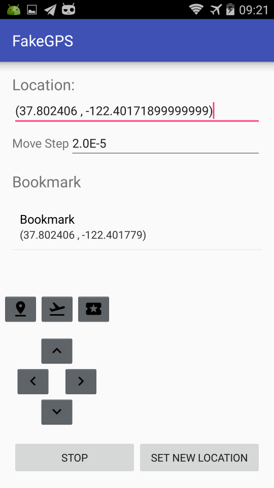

# FakeGPS

FakeGPS是一个GPS设备模拟器，能够根据给定的坐标，输出GPS定位信号，并且带有全局悬浮窗的手柄，通过手柄上的方向按键，能够模拟用户在地图上行走。

按照惯例，先放截图。




[下载地址](https://github.com/xiangtailiang/FakeGPS/releases/tag/2.0)

## 功能描述
- 模拟真实的GPS设备，每秒输出GPS定位信号。
- 具备两种运行模式：跳变模式和飞行模式。**跳变模式**：直接跳转到新的位置。**飞行模式**：根据给定的时间，以线性插值的方式慢慢飞行到新的位置。
- 带有全局浮窗手柄，点击手柄上的方向按键会在当前位置上做一定的偏移（通过Move Step设置，单位为度数）。手柄单击一次移动一格，长按会连续移动。
- 带有书签功能，点击使用，长按删除。
- 长按书签按钮可以复制当前坐标到剪切板，方便分享给其他小伙伴。

## 系统要求
- Android 5.0 (API 21) 及以上
- 已在 Android 16 (API 36) 上测试通过

## 安装说明

**v2.0 版本不再需要 Root！** 使用标准的 Android Mock Location API。

1. 安装 APK 到设备上（普通安装即可）。
2. 打开手机 **设置 → 开发者选项**（如未开启，需在"关于手机"中连续点击7次版本号）。
3. 在开发者选项中找到 **选择模拟位置信息应用**，选择 **FakeGPS**。
4. 打开 FakeGPS，输入坐标，点击 **Start**。
5. 首次使用会请求位置、通知和悬浮窗权限，请全部允许。
6. 手柄出现后，打开地图应用（谷歌地图、高德地图等）查看是否已定位到设置的坐标。

## v2.0 更新内容
- **无需Root** — 使用标准 `addTestProvider` / `setTestProviderLocation` API，替代了旧版的隐藏 `ILocationManager` 反射调用。
- **支持 Android 5.0 ~ 16**（API 21 ~ 36）。
- 从 Support Library 迁移到 **AndroidX**。
- 新增**前台服务**，带通知栏提示，确保 Android 8.0+ 后台稳定运行。
- 悬浮手柄使用 `TYPE_APPLICATION_OVERLAY`，兼容 Android 8.0+。
- 运行时权限请求：位置、通知（Android 13+）、悬浮窗。
- 日志存储适配 Scoped Storage。
- 构建工具链升级：Gradle 8.11.1、AGP 8.7.3、Java 17。

## 编译

```bash
./gradlew assembleDebug
```

APK 输出位置：`app/build/outputs/apk/debug/FakeGPS_v2.0.apk`

## 贡献
欢迎各位同学发 Pull Request 来帮忙改进，谢谢大家。

## License
[The MIT License (MIT)](http://opensource.org/licenses/MIT)
